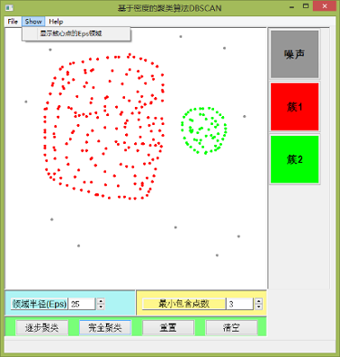
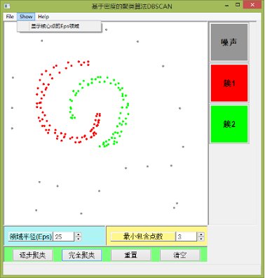
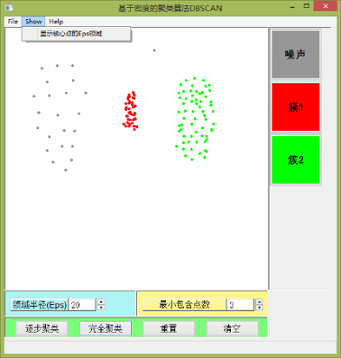
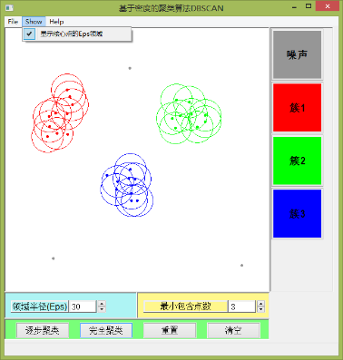
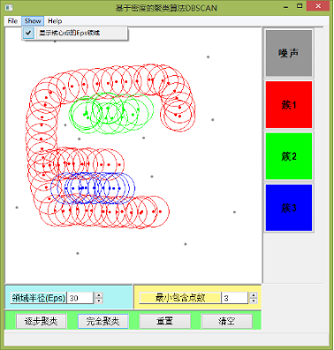
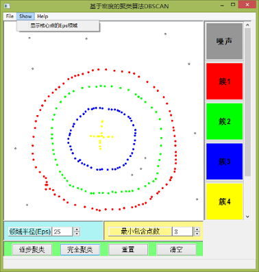
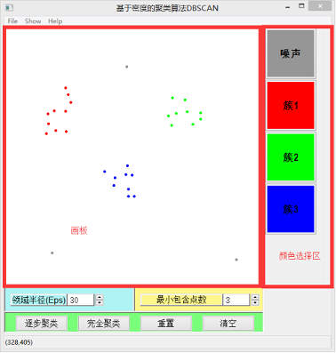

<b>DBSCAN——基于密度的聚类算法</b>
  

----------
# 算法介绍
定义：  
&emsp;&emsp;DBSCAN是一种基于高密度连通区域的聚类方法。该算法将具有足够高密度的区域划分为簇，并在具有噪声的空间数据库中发现任意形状的簇，它将簇定义为密度相连的点的最大集合。根据点的密度，点可分为三类：稠密区域内部的点（核心点），稠密区域边缘上的点（边界点），稀疏区域中的点（噪声或背景点）。

优点：  
&emsp;&emsp;可以识别具有任意形状和不同大小的簇，自动确定簇的数目，分离簇和环境噪声。

缺点：  
&emsp;&emsp;对于高维数据集、密度不同的数据集的聚类结果不理想。

# 作品展示
### 可以识别大小不同的簇:
  

### 可以识别形状不同的簇:
  

### 对不同密度构成的二维数据集产生的聚类结果不理想:
  

### 其它测试:
  

  

  

  

# 开发环境与工具
(1)操作系统：Windows8  
(2)编程语言：C++  
(3)程序开发平台：Code::Blocks  
(4)构架库：wxWidgets  
  
# 应用程序使用说明  
(1)应用程序界面如下：  
  
(2)画板：可通过在其上面单击鼠标左键添加点(每个点代表一个样本)。状态栏会显示当前鼠标在画板上的坐标。  
(3)颜色选择区：点击“噪声”按钮可修改噪声的颜色；点击“簇X”按钮可修改簇X（X>=1）的颜色。  
(4)菜单”File”->”Save”：可保存画板上的点集和参数Eps、MinPts.  
(5)菜单”File”->”Read”：可读取用上述方法保存的点集和参数Eps、MinPts.  
(6)菜单”Show”->”显示核心点的Eps邻域”：可显示或隐藏核心点的Eps邻域。  
(7)按钮”逐步聚类”：使用该功能时建议勾选”显示核心点的Eps邻域”。每步的定义为：若点集中有未标记为核心点的核心点，则选择其中一个核心点并将其Eps邻域中的点归入某个簇（已存在的簇或新的簇）；否则将未归入任何一个簇的点标记为噪声。任何改变画板上的点集或修改Eps、MinPts的行为都将重置该功能所记录的执行状态（即再次点击该按钮时会重新开始聚类）。  